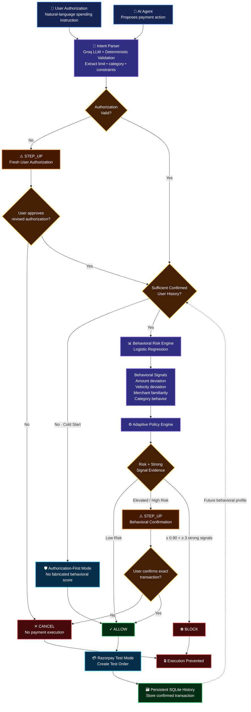

# AgentShield — System Architecture

This document describes the end-to-end architecture and decision flow of AgentShield, from agent authorization to behavioral risk evaluation and Razorpay test-order execution.

## Architecture Diagram

## Decision Philosophy

AgentShield separates **authorization** from **behavioral risk**:

- Authorization violation → `STEP_UP` for fresh authorization.
- Authorized but unusual behavior → `STEP_UP` for transaction confirmation.
- Low-risk authorized behavior → `ALLOW`.
- Very high risk supported by at least three strong independent anomaly signals → `BLOCK`.

This prevents unusual but legitimate transactions from being automatically treated as fraud.
